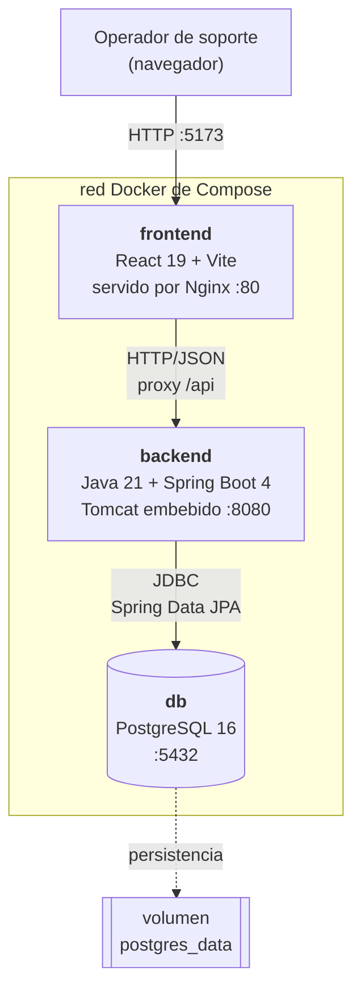
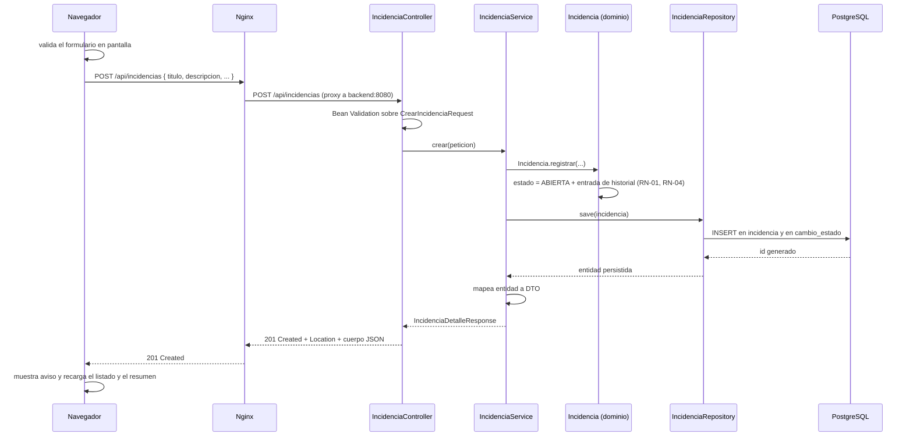
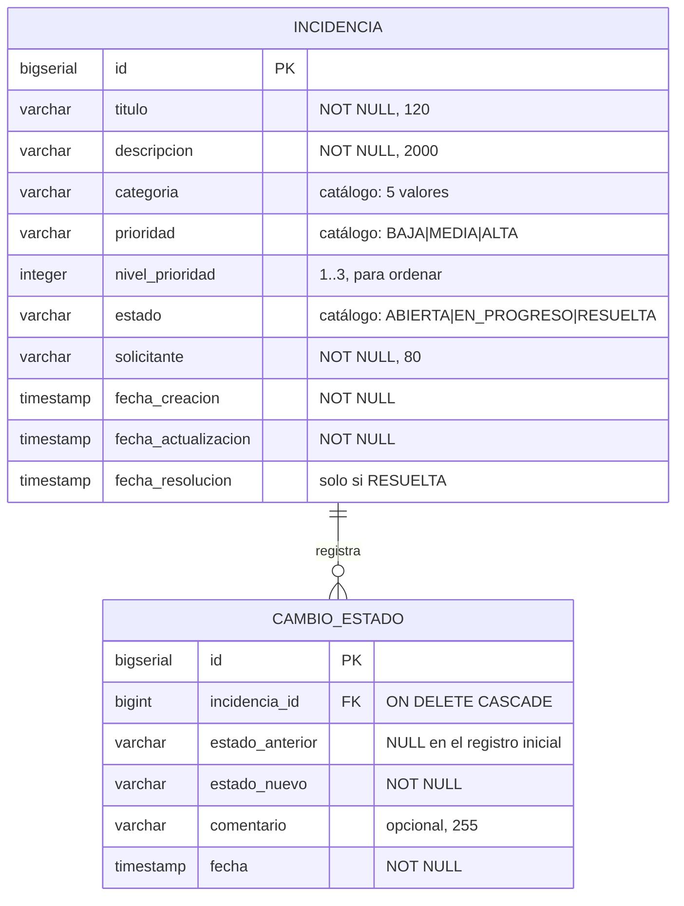

# Arquitectura — Mini Help Desk

Arquitectura deliberadamente simple: tres componentes, una responsabilidad clara
para cada uno y ninguna pieza que el equipo no pueda explicar. El detalle de
*por qué* se eligió cada alternativa está en [`decisiones.md`](decisiones.md).

---

## 1. Vista general



El navegador solo conoce un origen: `http://localhost:5173`. Nginx sirve los
archivos estáticos y reenvía todo lo que empiece con `/api` al servicio
`backend`. El backend es el único que habla con la base de datos.

### Flujo completo de una operación

Recorrido de "registrar una incidencia", que es la pregunta típica sobre
integración fullstack:



Si la validación falla en el controlador, la petición nunca llega al servicio y
`ManejadorGlobalErrores` responde 400 con el detalle por campo. Si la regla de
negocio falla en el dominio, la transacción se revierte y la respuesta es 409.

---

## 2. Responsabilidades

### Frontend — React + Vite

| Sí hace | No hace |
|---|---|
| Presentación y disposición en pantalla | Decidir el estado inicial de una incidencia |
| Manejo del estado de la interfaz (modales, filtros, avisos) | Decidir qué transiciones de estado son válidas |
| Consumo de la API REST y traducción de errores a mensajes | Filtrar u ordenar los datos en memoria |
| Validación de conveniencia antes de enviar el formulario | Ser la única barrera de validación |
| Confirmación previa a operaciones destructivas | Guardar datos por su cuenta |

El frontend **pinta** los botones de cambio de estado a partir del campo
`transicionesPermitidas` que le entrega el backend en cada incidencia. La regla
está escrita una sola vez, en el servidor.

### Backend — Spring Boot

| Capa | Paquete | Responsabilidad |
|---|---|---|
| Entrada HTTP | `controller` | Rutas, verbos, códigos de estado, activación de Bean Validation. Sin lógica de negocio. |
| Casos de uso | `service` | Transacciones, búsqueda de entidades, error 404, orquestación, mapeo a DTO. |
| Dominio | `models/entities` | Reglas de negocio e invariantes: estado inicial, transiciones válidas, historial, fecha de resolución. |
| Persistencia | `repository` | Acceso a datos y construcción del filtro dinámico con Specifications. |
| Contrato | `dto` | Forma de entrada y salida de la API, con las anotaciones de validación. |
| Traducción | `mapper` | Conversión entidad ⇄ DTO. |
| Errores | `exception` | Excepciones de dominio y `@RestControllerAdvice` con el formato único de error. |

### Base de datos — PostgreSQL

- Almacenamiento persistente de incidencias e historial.
- Integridad referencial: `cambio_estado.incidencia_id` referencia a
  `incidencia.id` con borrado en cascada, declarada en el mapeo JPA.
- Integridad de dominio: las reglas (estado, prioridad, categoría, nivel de
  prioridad y coherencia de la fecha de resolución) se garantizan en el código
  de la entidad; la base, al crearla Hibernate, no define restricciones `CHECK`
  (ver limitaciones en la sección 7).

---

## 3. Organización del código

```text
diagnostico/
├── backend/
│   ├── src/main/java/com/diagnostico/backend/
│   │   ├── BackendApplication.java
│   │   ├── controller/    IncidenciaController, CatalogoController
│   │   ├── dto/           records de request y response
│   │   ├── exception/     ManejadorGlobalErrores + excepciones propias
│   │   ├── mapper/        IncidenciaMapper
│   │   ├── models/entities/  Incidencia, CambioEstado, Estado, Prioridad, Categoria, Orden
│   │   ├── repository/    IncidenciaRepository, IncidenciaSpecs
│   │   └── service/       IncidenciaService
│   ├── src/main/resources/
│   │   └── application.properties
│   ├── src/test/java/     BackendApplicationTests (prueba de contexto)
│   ├── Dockerfile
│   └── pom.xml
├── mi-app/
│   ├── src/
│   │   ├── api/cliente.js       única puerta de salida hacia la API
│   │   ├── components/          componentes de presentación
│   │   ├── App.jsx              estado de la pantalla y coordinación
│   │   ├── formato.js           helpers de fecha y etiquetas
│   │   ├── index.css            sistema de tokens y estilos
│   │   └── main.jsx             punto de entrada de React
│   ├── Dockerfile
│   ├── nginx.conf
│   └── vite.config.js
├── docs/
├── compose.yaml
├── .env.example
└── README.md
```

---

## 4. Modelo de datos



### Campos adicionales y su justificación

El desafío pide un mínimo de siete campos. Se agregaron tres, cada uno con un
motivo concreto:

| Campo | Por qué existe |
|---|---|
| `solicitante` | Sin él no se sabe a quién avisar cuando el caso se resuelve. Es el dato que más se pierde hoy en la mensajería informal. |
| `fecha_actualizacion` | Permite distinguir un caso abierto hace una semana pero trabajado hoy de uno realmente abandonado. |
| `fecha_resolucion` | Permite medir cuánto demoró la atención, que es la pregunta que motivó construir la herramienta. |
| `nivel_prioridad` | Decisión técnica, no de negocio: la prioridad se guarda como texto, y ordenar esa columna daría ALTA, BAJA, MEDIA. El nivel numérico permite un `ORDER BY` correcto. Se mantiene sincronizado automáticamente por la entidad. |

### Esquema y creación de tablas

El esquema lo crea **Hibernate** a partir de las entidades, con `ddl-auto:
update` (configurado en Compose con `SPRING_JPA_HIBERNATE_DDL_AUTO: update`):
al arrancar, crea las tablas que falten y ajusta columnas nuevas sin borrar
datos. No hay migraciones versionadas estilo Flyway, y por lo tanto las reglas
de negocio no están duplicadas como restricciones `CHECK` en la base de datos:
se sostienen exclusivamente en el código de la entidad. Es una limitación
conocida —sin historial de migraciones el esquema evoluciona en silencio— y se
documenta en la sección 7.

---

## 5. Contrato de la API

Base: `/api`. Formato: JSON. Codificación: UTF-8.

| Método | Ruta | Entrada | Éxito | Errores posibles |
|---|---|---|---|---|
| `GET` | `/api/incidencias` | Parámetros opcionales `estado`, `prioridad`, `categoria`, `buscar`, `orden` | `200` lista de incidencias | `400` valor de enum inválido |
| `GET` | `/api/incidencias/resumen` | — | `200` contadores por estado | — |
| `GET` | `/api/incidencias/{id}` | — | `200` incidencia + historial | `404` id inexistente |
| `POST` | `/api/incidencias` | `CrearIncidenciaRequest` | `201` + cabecera `Location` | `400` validación |
| `PUT` | `/api/incidencias/{id}` | `ActualizarIncidenciaRequest` | `200` incidencia + historial | `400` validación, `404` id inexistente, `409` incidencia resuelta |
| `PATCH` | `/api/incidencias/{id}/estado` | `CambiarEstadoRequest` | `200` incidencia + historial | `400` validación, `404` id inexistente, `409` transición no permitida |
| `DELETE` | `/api/incidencias/{id}` | — | `204` sin cuerpo | `404` id inexistente |
| `GET` | `/api/catalogos` | — | `200` valores válidos de cada enum | — |

### Criterio de códigos HTTP

- **200** operación exitosa con cuerpo.
- **201** recurso creado; se devuelve `Location` con su URL.
- **204** operación exitosa sin cuerpo (eliminación).
- **400** la petición está mal formada: falta un campo, largo fuera de rango,
  valor que no pertenece al catálogo.
- **404** el identificador no corresponde a ningún recurso.
- **409** la petición es válida pero rompe una regla de negocio. Se separa del
  400 a propósito: el cliente no puede corregirlo cambiando el formato del dato,
  sino cambiando la operación que intenta.
- **500** error no previsto; se registra completo en el log y se responde un
  mensaje genérico.

### Ejemplos

**Crear una incidencia**

```http
POST /api/incidencias
Content-Type: application/json

{
  "titulo": "Impresora de contabilidad no responde",
  "descripcion": "Los documentos quedan en la cola y nunca salen.",
  "categoria": "HARDWARE",
  "prioridad": "MEDIA",
  "solicitante": "Marcela Herrera"
}
```

```http
201 Created
Location: /api/incidencias/9

{
  "incidencia": {
    "id": 9,
    "titulo": "Impresora de contabilidad no responde",
    "descripcion": "Los documentos quedan en la cola y nunca salen.",
    "categoria": "HARDWARE",
    "prioridad": "MEDIA",
    "estado": "ABIERTA",
    "solicitante": "Marcela Herrera",
    "fechaCreacion": "2026-08-11T09:15:22.418",
    "fechaActualizacion": "2026-08-11T09:15:22.418",
    "fechaResolucion": null,
    "transicionesPermitidas": ["EN_PROGRESO", "RESUELTA"]
  },
  "historial": [
    {
      "id": 21,
      "estadoAnterior": null,
      "estadoNuevo": "ABIERTA",
      "comentario": "Incidencia registrada",
      "fecha": "2026-08-11T09:15:22.418"
    }
  ]
}
```

**Formato único de error**

```http
400 Bad Request

{
  "marcaTiempo": "2026-08-11T09:16:04.902",
  "estado": 400,
  "error": "Datos inválidos",
  "mensaje": "El título debe tener entre 5 y 120 caracteres.",
  "ruta": "/api/incidencias",
  "detalles": [
    { "campo": "titulo", "mensaje": "El título debe tener entre 5 y 120 caracteres." }
  ]
}
```

Todos los errores comparten estas seis claves. `detalles` viene como arreglo
vacío cuando el error no está asociado a un campo puntual.

---

## 6. Arquitectura de ejecución en Docker

```text
                            HOST
   :5173 ──────────┐
                   │
   ┌───────────────▼──┐  ┌─────────────┐  ┌──────────────┐
   │     frontend     │  │   backend   │  │   database   │
   │ nginx:1.27-alpine│  │temurin:21-jre│  │postgres:16   │
   │      :80         │─▶│    :8080     │─▶│   :5432      │
   └──────────────────┘  └─────────────┘  └───────┬──────┘
                                                  │
      red de Compose (por defecto)                ▼
                                        volumen: postgres_data
```

| Servicio | Imagen base | Puerto interno | Puerto en el host | Depende de |
|---|---|---|---|---|
| `frontend` | `nginx:1.27-alpine` | 80 | `${FRONTEND_PORT:-5173}` | `backend` |
| `backend` | `eclipse-temurin:21-jre` | 8080 | — (sin publicar) | `database` sana |
| `database` | `postgres:16-alpine` | 5432 | — (sin publicar) | — |

**Comunicación entre servicios.** Los tres contenedores comparten la red que
crea Compose por defecto. Docker levanta un DNS interno donde el nombre del
servicio resuelve a la IP del contenedor. Por eso el backend se conecta a
`jdbc:postgresql://database:5432/helpdesk` y Nginx hace proxy a
`http://backend:8080/api/`. Usar `localhost` ahí sería un error: dentro del
contenedor del backend, `localhost` es el propio backend.

**Orden de arranque.** `backend` declara `depends_on` sobre `database` con
`condition: service_healthy`: Compose espera a que Postgres responda a
`pg_isready` antes de levantar el backend, evitando que intente conectarse
mientras el clúster aún inicializa. `frontend` depende de `backend` sin
condición de salud; al no publicarse el puerto del backend, la verificación
desde afuera se hace a través del proxy de Nginx en `:5173`.

**Persistencia.** El volumen con nombre `postgres_data` está montado en
`/var/lib/postgresql/data`. Los datos viven en el volumen, no en la capa
escribible del contenedor, así que sobreviven a `docker compose down` y a
`docker compose up --build`.

**Variables de entorno.** Compose las lee del archivo `.env` (o usa el valor por
defecto declarado con `${VARIABLE:-valor}`) y las inyecta en cada contenedor.
En el backend, Spring Boot las mapea a propiedades por convención:
`SPRING_DATASOURCE_URL`, `SPRING_DATASOURCE_USERNAME` y
`SPRING_DATASOURCE_PASSWORD` alimentan a `spring.datasource.*`, y
`SPRING_JPA_HIBERNATE_DDL_AUTO` a `spring.jpa.hibernate.ddl-auto`. En el
frontend no se usa ninguna variable en tiempo de build: el bundle se compila
siempre contra la ruta relativa `/api`, que Nginx reenvía al backend, de modo
que el mismo artefacto sirve en cualquier entorno.

---

## 7. Limitaciones conocidas de la arquitectura

| Limitación | Impacto | Cómo se abordaría |
|---|---|---|
| El esquema lo crea Hibernate con `ddl-auto: update`, sin migraciones versionadas | No hay historial de cambios de esquema; las restricciones `CHECK` solo viven en el código | Adoptar Flyway: scripts versionados, `ddl-auto: validate` y restricciones a nivel de base. |
| El listado no está paginado | Con miles de incidencias la respuesta crece sin control | Cambiar `findAll` por `Page<Incidencia>` con `Pageable`; el contrato ya devuelve un arreglo, habría que envolverlo. |
| `resumen` ejecuta una consulta `count` por estado | Tres consultas donde bastaría una con `GROUP BY` | Reemplazar por una consulta agregada cuando el volumen lo justifique. |
| El backend no publica puerto en el host | Solo se puede operar a través del proxy de Nginx o dentro de la red de Compose | Publicar `8080` en Compose si se necesita acceso directo para depuración. |
| No hay healthcheck del backend | Compose no detecta si arrancó mal; `frontend` no espera a que esté sano | Agregar `spring-boot-starter-actuator` y encadenar con `condition: service_healthy`. |
| No hay autenticación | Cualquiera con acceso a la red puede operar la API | Fuera de alcance declarado; correspondería Spring Security con JWT. |
| Búsqueda con `LIKE %texto%` | No usa índice; degrada con muchas filas | Índice de texto completo de PostgreSQL (`tsvector` + GIN). |
| Las credenciales viajan como variables de entorno en claro | Aceptable en desarrollo local, no en producción | Docker secrets o un gestor de secretos del proveedor cloud. |
| El backend no reintenta si la base cae después de arrancar | La petición falla | Configuración de reintentos del pool de conexiones y política de reinicio. |
